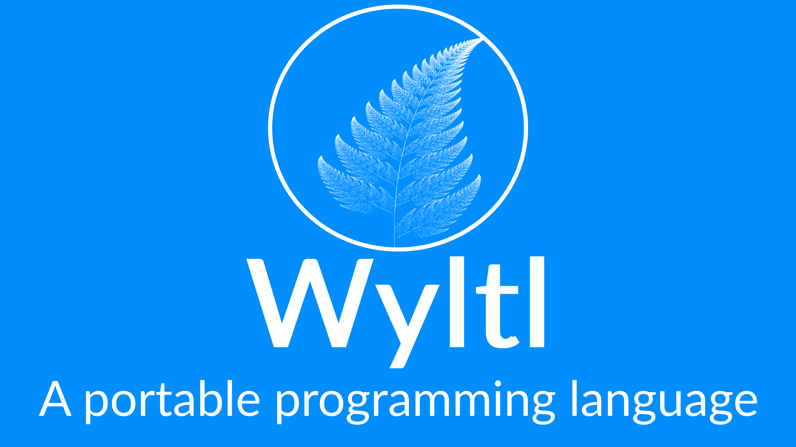

# Wyltl Syntax Highlighting for VS Code

This extension provides preliminary Syntax Highlighting Support for the Wyltl Programming Language

# What is Wyltl?

Wyltl is a programming language made with the goal of striking a balance between simplicity, portability, embeddability and functionality. With a simple syntax and a feature rich standard library - Wyltl is a language that aims to improve the programming experience of new and experienced Programmers

# Where can I download or try Wyltl?

Wyltl is distributed from the [Wyltl Website](https://dineth-lochana.github.io/Wyltl). You can also use the Wyltl Playground [Wyltl Playground](https://dineth-lochana.github.io/Wyltl/practice.html) to write and execute Wyltl Code Online!